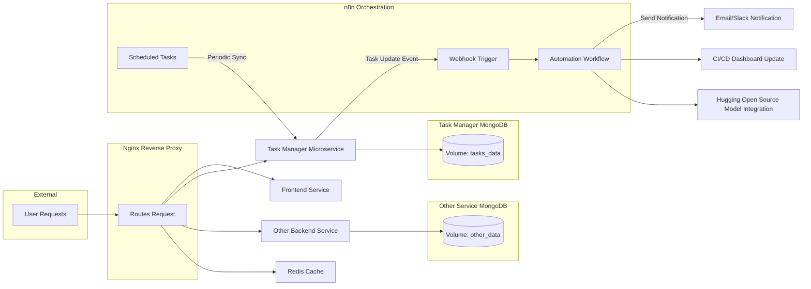

## 1. Overall Architecture

### Core Components

- **Frontend Service**  
  - **Technology:** Modern JavaScript framework (React or Vue) with a minimal, clean, and responsive design.  
  - **Features:**  
    - Hot Reload using bind mounts (for real-time updates during development).  
    - Delivered via an Nginx container (which also acts as a reverse proxy).

- **Backend Microservices**  
  You’ll have at least two independent microservices, each with its own isolated database:
  - **Task Manager Microservice:**  
    - **Purpose:** Handles markdown-based checklist tasks.  
    - **API:** Exposes RESTful endpoints for creating, updating, retrieving, and deleting tasks.  
    - **Data Storage:** Uses its own MongoDB container with dedicated, named Docker volumes.
  - **Additional Microservice:**  
    - **Purpose:** Could be for user management, authentication, or another domain-specific function.  
    - **Data Storage:** Runs with its own isolated MongoDB container and volume.

- **Infrastructure Services**  
  - **Nginx Reverse Proxy:**  
    - Routes incoming requests from external users to the correct service (frontend or backend).  
    - Provides caching for static content and optional dynamic caching.
  - **Caching Layer (Optional):**  
    - A Redis container may be used for caching API responses, session data, or even for message queuing if needed.
    
- **CI/CD Pipeline**  
  - Implemented with GitLab CI/CD to build, test, and deploy your Docker images.
  - Includes SAST on Dockerfiles, vulnerability scanning, and automated pushes to Docker Hub.

---

## 2. Network Isolation and Data Persistence

- **Network Isolation:**  
  - Each microservice (and its corresponding MongoDB container) runs on its own Docker network segment.  
  - The backend microservice for tasks cannot access the database of the other service, and the host is prevented from direct communication with these databases.

- **Data Persistence:**  
  - Docker volumes are used to ensure that database data persists across container and host reboots.  
  - Each database uses a separate, logically named volume to enforce isolation and simplify maintenance.

---

## 3. n8n as the Orchestration & Automation Layer

n8n is used not as the main application server but as an overlay automation engine. Its integration provides the following capabilities:

### UI-Based Workflow Automation
- **Rapid Prototyping and Adjustments:**  
  - With n8n’s intuitive UI, non-developers can easily build, modify, and deploy automation workflows without changing the core microservices.
  - Example workflows include:
    - **Event-Triggered Notifications:** When a task is updated in the Task Manager, a webhook (or scheduled trigger) in n8n can send notifications (via email, Slack, or push notifications) to users.
    - **Data Synchronization:** n8n can periodically query backend APIs and update a central dashboard or perform status checks.
  
### Integration and Orchestration
- **Cross-Service Coordination:**  
  - n8n can listen for events (using webhook or schedule nodes) from any microservice and trigger actions—such as updating task status, performing logging, or initiating additional security scans.
  
### CI/CD & Infrastructure Automation
- **Supporting Deployment Processes:**  
  - n8n workflows can be part of the CI/CD pipeline. For example, after a successful build, an n8n workflow might update a dashboard, notify the team, or trigger post-deployment tests.
  
### Hugging Open Source Model Integration
- **Optional AI Enhancements:**  
  - When advanced natural language processing or AI-driven interactions are required, you can integrate an open-source model (e.g., from Hugging Face).  
  - n8n’s AI Agent node can be configured to use a Hugging Face model, providing a flexible alternative to proprietary APIs.  
  - This integration allows you to tailor AI responses, perform sentiment analysis, or generate content in a fully open-source and customizable environment.

### Example Workflow Diagram with n8n Integration

---

## 4. CI/CD Pipeline and Deployment

- **Docker and GitLab CI/CD:**  
  - Each microservice (frontend, backend, Nginx) has its own Dockerfile following best practices (multi-stage builds, non-root users).
  - GitLab CI/CD runs automated tests, performs SAST, and pushes secure, minimal Docker images to Docker Hub.
  - The CI/CD pipeline includes a stage that triggers n8n workflows (via API calls) to notify teams of deployment status.

- **Volume Management and Hot Reloading:**  
  - Separate Docker volumes ensure data persistence for each MongoDB instance.
  - Frontend development uses bind mounts for hot reloading, ensuring the UI updates in real time.

---

## 5. Task Management Application

### Backend (Task Manager Microservice)
- **API Endpoints:**  
  - Create, update, delete, and retrieve tasks (each stored as markdown-based checklists).
- **Database:**  
  - MongoDB is used to store tasks, preserving markdown formatting.
- **Security:**  
  - The microservice is isolated in its own network, with secure Docker volumes for persistent storage.

### Frontend UI
- **Design:**  
  - A modern, minimal interface focused on ease of use.
  - Supports live markdown editing with a preview feature.
- **Integration:**  
  - The UI communicates with the Task Manager API.
  - It is served via Nginx, which caches static assets for improved performance.

### n8n Integration for Task Workflows
- **Workflow Automation:**  
  - Automate task reminders or status updates triggered by events (e.g., overdue tasks).
  - Use n8n’s webhook or scheduled nodes to listen for changes in the Task Manager and trigger notifications.
  - Non-developers can adjust these workflows via n8n’s UI.

---

## 6. Additional Enhancements (Optional Bonuses)

- **Reverse Proxy and Load Balancer:**  
  - Configure an advanced Nginx setup to serve as both a reverse proxy and load balancer.  
  - This layer handles SSL termination, distributes traffic across multiple instances of your services, and improves overall availability and scalability.
  
---

## Summary

This design combines a robust microservices architecture with a modern, minimal frontend and secure, isolated backend services. n8n is integrated as a flexible orchestration layer that automates cross-service tasks, handles event-driven notifications, supports CI/CD automation, and even integrates with a Hugging Face open source model for AI functionalities. This layered approach enables both developers and non-developers to easily manage and adjust automations via n8n's intuitive UI, without modifying the core application code.

